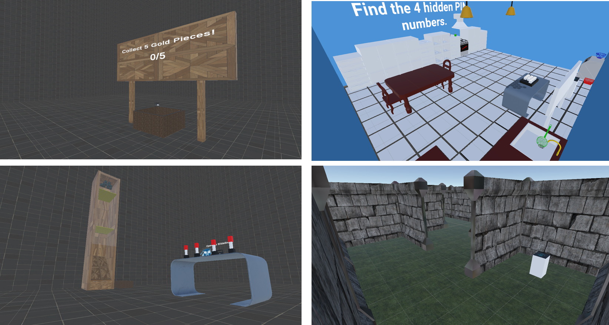

# Escape Room VR Game

A fast-paced, multi-room virtual reality escape room experience developed at **Universität Konstanz** (February 2023). Focused on dynamic level design, interactive puzzles, and high replayability through randomized room selection.

---

## Overview
Players navigate through a series of randomly generated VR rooms, solving riddles and manipulating interactive objects to progress. Each playthrough offers a unique sequence of challenges, blending classic escape room mechanics with VR-native interactions. The project emphasizes efficient development workflows, asset reuse, and seamless scene transitions.

---

## Key Features
- **Randomized Room Selection**: Dynamic level ordering ensures high replayability and surprise factor
- **Interactive Puzzles & Riddles**: Environment-based problem solving with tactile VR interactions
- **Multiple Mini-Games**: Memory, Sphere Shooting, Basketball, PIN Finding, Maze, Colorful Buttons, Lever, and Coin Collector challenges
- **Core Systems**: Leaderboard tracking, dynamic scene switching, VR navigation, and tutorial onboarding
- **Optimized Workflow**: Heavy reliance on existing assets and community resources to accelerate development

---

## Tech Stack
- **Engine**: Unity
- **Language**: C#
- **Version Control**: Git (with Unity-specific `.gitignore` & LFS considerations)
- **VR Integration**: Unity XR Interaction Toolkit / OpenXR
- **Audio**: Unity Audio Mixer + open-source/community sound libraries
